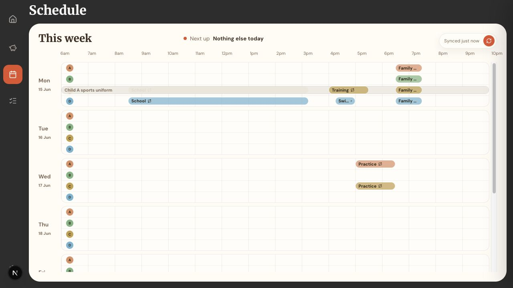
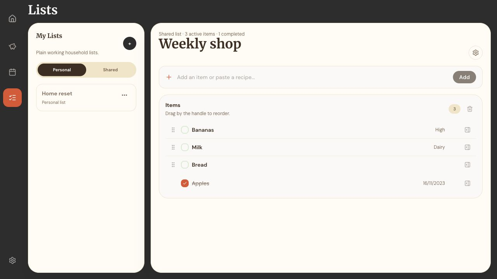

# Doma

**A private operating system for everyday household life. _Doma_: a Czech word for "at home."**

Doma brings schedules, shared lists, finances, and an AI-powered bot into one
private home dashboard: a suite of independently deployed apps that can use the
framework best suited to each job while still feeling like one product.

> This is a personal project built around private household data. The repository
> contains only generic fixtures and examples; there is no public demo.

## The product

Household admin rarely lives in one neat system. Financial history sits in a
spreadsheet, plans live in calendars, shopping lists drift between phones, and
the useful details for tomorrow are buried across all three.

Doma is designed to work well on the devices household admin actually happens
on: responsive layouts for phones and laptops, plus installable PWA shells for
quick access from a home screen.

Doma gives each problem a focused surface:

- **Budget** turns raw financial captures into monthly trends and account views.
- **Schedule** reshapes shared calendars into a readable week for the household.
- **Lists** supports flexible personal and shared checklists with typed properties.
- **AI Bot** turns calendar details into short, actionable morning briefings, delivered through a provider-neutral notification gateway.

<table>
  <tr>
    <td width="50%">
      
    </td>
    <td width="50%">
      
    </td>
  </tr>
  <tr>
    <td align="center"><strong>Schedule</strong> — the household week at a glance</td>
    <td align="center"><strong>Lists</strong> — flexible lists without task-manager ceremony</td>
  </tr>
</table>

## AI-native development workflow

Doma is not just an app that uses AI features. It is also developed with an
AI-first workflow built around a task board, repo-specific skills, and agent
review loops.

Work usually starts in Linear, in the `Doma` project on the `Ray` team, where
ideas, bugs, PRDs, and product work move through Linear states such as
`Backlog`, `Todo`, `In Progress`, and `Done`. Triage still uses explicit labels
such as `needs-triage`, `ready-for-agent`, and `ready-for-human`, so agents can
pick up work with the same vocabulary across planning and implementation. From
there, agents work inside the repo with the project's own rules for privacy,
testing, documentation, and git workflow.

The development process is deliberately structured. Design-heavy work is often
shaped with skills such as `superpowers`, `brainstorming`, or `grill-me` to
stress-test requirements before implementation. Once a task is clear, agents use
repo-specific commands, architecture docs, and verification steps to make the
change, update any stale documentation, and keep private household data out of
git at every stage.

The output is treated like normal engineering work, not magic. Changes are
committed to branches, pushed to GitHub, and opened as pull requests. Other
agents can then review the diff, call out problems, and force another pass
before the branch is considered ready to merge.

## Technical playground

Doma looks like one application, but it is a small federation of products behind
one domain. Vercel Multi-Zones lets every app build and deploy independently:

| Surface     | Role                                         | Framework                 |
| ----------- | -------------------------------------------- | ------------------------- |
| Home        | Apex zone, navigation, and settings          | TanStack Start + React 19 |
| Budget      | Finance dashboard and analysis               | TanStack Start + React 19 |
| Schedule    | Readable weekly household calendar           | Next.js App Router        |
| Lists       | Personal and shared structured lists         | SvelteKit + Svelte 5      |
| Bot gateway | Notifications, linking, and inbound commands | Hono                      |

The zones share a Clerk session, Convex backend, navigation registry, and design
tokens. Cross-app navigation uses real page loads, so each surface keeps its own
runtime and deployment boundary without losing the feel of a single product.

## Design decisions

### One product, independent zones

The apex app rewrites `/budget`, `/schedule`, and `/lists` to separate Vercel
projects. A broken experiment in one app does not have to block every other app,
and each surface can evolve or deploy on its own cadence.

### Shared language, not a forced shared framework

React apps reuse a shared shell and UI primitives. The Svelte app stays native
to Svelte while consuming the same framework-neutral app registry and Tailwind
design tokens. The contract is product identity and navigation—not a universal
component abstraction.

### Raw inputs in, derived views out

The finance model stores source values and derives totals at read time. This
keeps computed data from drifting out of sync and preserves a clear distinction
between imported facts and product interpretation. Money is stored as integer
cents; external inputs such as exchange rates remain explicit.

### Convex first, small services at the edges

Convex owns the shared data model, reactive queries, and most business logic.
Provider webhooks and notification delivery live behind a small Hono gateway,
keeping Telegram-specific details out of product features and leaving room for
other channels later.

### Offline boundaries

The installable apps cache their static shells, but live Convex data remains
network-only. Full offline sync is deferred until a product surface genuinely
needs it; the current UI never implies that edits are safe offline when they are
not. The aim is mobile-friendly, app-like access without pretending every
surface already has full offline behaviour.

### Privacy is part of the architecture

Real account labels, institutions, calendar details, notification payloads, and
household names never enter git. Fixture modes use neutral examples so UI work,
tests, and screenshots stay useful without turning personal data into repository
history.

## Technology

| Area     | Tools                                                 | Why they are here                                              |
| -------- | ----------------------------------------------------- | -------------------------------------------------------------- |
| Monorepo | Turborepo, pnpm                                       | Fast workspace orchestration and clear app boundaries          |
| Frontend | React 19, TanStack Start, Next.js, SvelteKit          | A practical comparison of modern full-stack UI approaches      |
| Data     | Convex                                                | Reactive shared data with typed server functions               |
| Identity | Clerk                                                 | One household session across independently deployed zones      |
| Styling  | Tailwind CSS v4, shared design tokens, shadcn/ui      | Consistent visual language without coupling every app to React |
| Services | Hono, Upstash Redis                                   | Small provider-facing APIs and webhook state                   |
| Quality  | TypeScript, Vitest, Testing Library, ESLint, Prettier | Fast feedback across a mixed-framework workspace               |
| Delivery | Vercel Multi-Zones, GitHub Actions                    | Independent deployments behind one domain                      |

## Run it locally

The repository uses the `pnpm` version declared in `package.json` and Node.js 18 or newer. If your shell resolves a different pnpm version, run `corepack enable pnpm`.

```bash
pnpm install
pnpm dev
```

Each UI runs on its own port because Vercel rewrites are not active locally:

- Home: [localhost:3000](http://localhost:3000)
- Budget: [localhost:3001](http://localhost:3001)
- Schedule: [localhost:3003](http://localhost:3003)
- Lists: [localhost:3004](http://localhost:3004)

Common workspace checks:

```bash
pnpm ci:local
```

Or run individual checks:

```bash
pnpm format:check
pnpm lint
pnpm check-types
pnpm test
pnpm build
```

## Explore the architecture

- [Architecture](docs/architecture.md) — zones, shared packages, auth across
  local origins, and deployment boundaries
- [Convex backend](docs/convex-backend.md) — data modelling, derivation, calendar
  ingestion, and morning briefings
- [Frontend](docs/frontend.md) — framework conventions and shared UI
- [Offline strategy](docs/offline.md) — the intentional boundary between an
  offline shell and offline data
- [Deployment](docs/deployment.md) — how the zones become one product on Vercel
- [Testing and CI](docs/testing-and-ci.md) — workspace checks and pipelines
